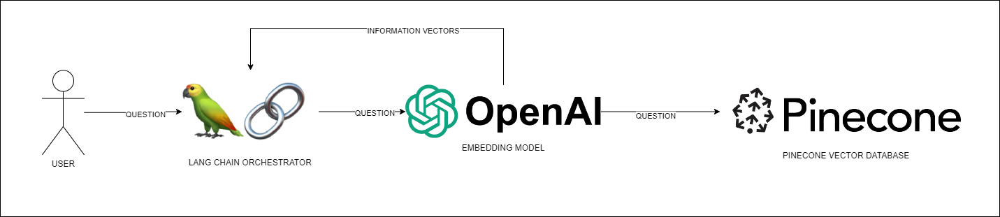
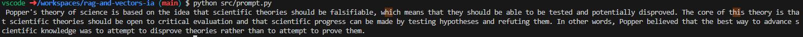
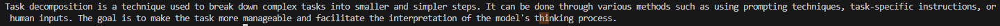
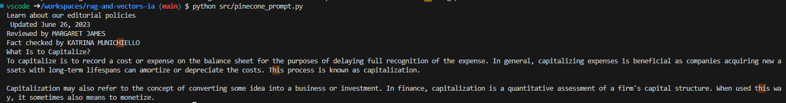

# RAG (Retrieval augmented generation)

A large language model experiment using semantic search with OpenAI and Pinecone.

# Architecture

The architecture of this project is as follows.



A lanh chain orchestrator asks an embedding model to query vector data from a specific question. The returned data is then used for consumption of the LLM to respond a specific question.

# Prerequisites

- Docker
- AWS
- Visual studio: dev containers plugin


## How to build the architecture

Open the folder with the dev containers plugin and wait the container to start. The container has the following libraries:
- Python


First create your environment variables in a .env file

```bash
OPENAI_API_KEY={OPENAI_API_KEY}
PINECONE_ENV=gcp-starter
PINECONE_API_KEY={PINECONE_API_KEY}
```


## RAG with OpenAI data

Run the following command to query a question from the OpenAI vector database.

```bash
python src/prompt.py
```

If out question is **What is at the core of Popper's theory of science?** we get.



## RAG with an in memory database

Run the following command to query a question based on data taken from a web page vectorized into memory.

```bash
python src/rag.py
```

If out question is **What is Task Decomposition?** we get.



Here we take a web page, split the web page data and store it in a vector database in memory.


## RAG with an external database - Pinecone

Run the following command to query a question based on data taken from text stored in Pinecone, a vector database.

```bash
python src/pinecone_prompt.py
```

If out question is **What is capitalization?** we get.



Here we take a local document, load it into a pinecone index, make a semantic search to obtain an answer into the pinecone integration.